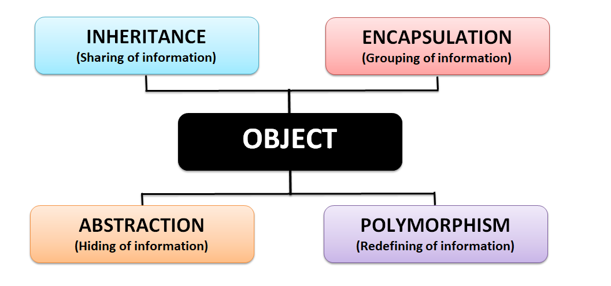

# OOP Review

## Pillars



## Encapsulation (Methods)

Performs an action.

Function that belongs to a class/object.

### Instance v Static

Instance : Attached to the object

```java
public class Card {
  public String toString(){
    return "Card";
  }

  public static void main(String[] args){
    Card c = new Card();
    c.toString();
  }
}

```

Static : Attached to the class

```java
public class Card {
  public static String toString(){
    return "Card";
  }

  public static void main(String[] args){
    // Card c = new Card();
    Card.toString();
  }
}
```

## Abstraction

### Private v Public

Private : accessible only within the class

Public : accessible outside of the class

## Polymorphism

### Method Override

Replacing a behavior of a method called the same, often connected to the concept of Inheritance

### Method Overload

Creating multiple methods that have a different signature (different parameters) to behave differently, based on what is given

## Inheritance

### Class Inheritance (extends)

### Interface and Abstract Classes (implements)
